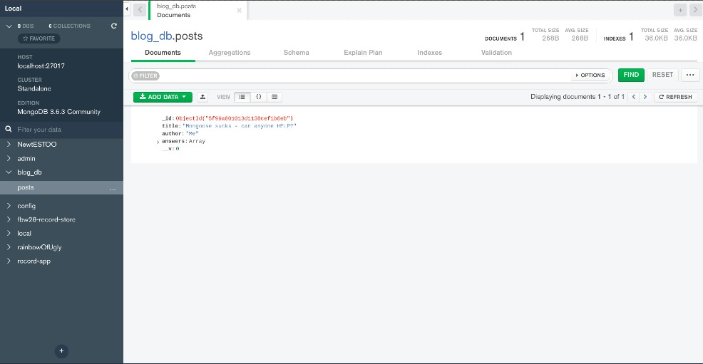

#### LESSON OF THE DAY (MONGO 5) with Robert

##### Nesting schemas | Populating

<br>
<br>
<br>

<!-- #### Harcoded response to front End -->

##### 1 SET UP THE FOLLOWING

- install the dotenv and set up the folder with the PORT=5000
- install the dependencies and then import them
- create the .gitignore folder
- add the node_modules/ and the .env inside the gitignore folder
- You can copy the dependencies below and type npm i , it will install them automatically.
- but dont do it after you have set up the gitignore and all what it contains or you will be exposing the sensitive data.

###### SCRIPTS and the stuff you should have to make it work

```javascript
  "scripts": {
    //   command to start the server when all is ready: npm start
    "start": "nodemon server.js",
    // to kill the server
    "killnode": "lsof -ti :5000 | xargs kill "
  },
//   random tags
  "keywords": [
    "authors",
    "mern",
    "project",
    "backend",
    "api"
  ],
  "author": "nadia mariduena",
  "license": "ISC",
//   super important
  "dependencies": {
    "bcrypt": "^5.0.0",
    "body-parser": "^1.19.0",
    "dotenv": "^8.2.0",
    "express": "^4.17.1",
    "express-validator": "^6.6.1",
    "mongoose": "^5.10.10",
    "nodemon": "^2.0.6"
  }
}

```

##### 2 IMPORT THEM and set up the SERVER (steps 1, 2, 3 PORT)

```javascript

const express = require("express");
//1 PORT related,  install the .env   npm i dotenv
const env = require("dotenv");
const app = express();
const mongoose = require("mongoose");
const { Schema, model } = mongoose; //add the functions,  import this otherwise the schema will not work
//
// environment variable or you can say constant
//  2 PORT related
env.config();

//--------------------
// Way without .env
// let PORT = 5000;
// app.listen(PORT, () => console.log("Server running and on fire"));


// 3 PORT related
app.listen(process.env.PORT, () => {
  console.log(`Server is running on PORT ${process.env.PORT}`);
});

// --------------------
/*
```

##### 3 CREATE THE MONGOOSE CONNECTION

```javascript
mongoose
  .connect("mongodb://localhost/blog_db", {
    // the following lines will prepare you for any eventual warning
    useNewUrlParser: true,
    useUnifiedTopology: true,
    useCreateIndex: true,
    useFindAndModify: false,
  })
  .then(() => console.log("Connected to DB succesfully"))
  //   if there s any error launch this message
  .catch((err) => console.log("Connection failed", err.message));
```

<br>
<br>
<br>

## START

##### 1 CREATE the MODELS and the respective SCHEMAS

```javascript
//
//1 EMBEDDING : incrustación -------------
//before : const CommentSchema = new Schema({
const AnswerSchema = new Schema({
  text: {
    type: String,
    required: true,
  },
});

//
//2 EXAMPLE : EMBEDDING / NESTING A SCHEMA
// the library: Schema({
const PostSchema = new Schema({
  title: {
    type: String,
    required: true,
  },
  author: {
    type: String,
    required: true,
  },
  // Posts can have 0 comments or many
  answers: [AnswerSchema],
  //here you can have multiple comments, just like [CommentSchema]
});
// --------------------------------------
//
//
//3  KEEPING A RECORD OF THE SCHEMA STRUCTURE with the model
const Post = model("Post", PostSchema);
//
//4
app.get("/seed", async (req, res, next) => {
  //
  //
  // 8 CLEAN all with DELETE MANY
  await Post.deleteMany(); //delete all collections from
  /*

                    await Post.deleteMany();
  The ABOVE :

  He decided to clean the structure because he changed the names
  and then refreshed the localhost, from the moment he did that
  the new structure was going to be mixed with the new one
  that s why he decided to add the DELETEMANY so to start all over again 
  and when refreshing you will only have the NEW ONE with the new changes

  CAREFUL!!

  Before we insert Post:

   const post = new Post({

    this can collide with this:

    Post.deleteMany();
                THATS WHY YOU HAVE TO ADD THE AWAIT:
                
                await Post.deleteMany();
                
                so to wait until the deletion
                is COMPLETED, afterwards create the new POST
  
  
                          const post = new Post({
                          title: "Mongoose sucks - can anyone HELP?",
                          author: "Me",
                          answers: [
                            {
                              text: "Mongoose is not that hard, Try harder",
                            },
                            {
                              text: "The author is right, Mongoose sucks, there s no point!",
                            },
                          ],
                        });
  
  
  
  */
  //5
  const post = new Post({
    title: "Mongoose sucks - can anyone HELP?",
    author: "Me",
    answers: [
      {
        text: "Mongoose is not that hard, Try harder",
      },
      {
        text: "The author is right, Mongoose sucks, there s no point!",
      },
    ],
  });
  //6 save the post: new Post({
  // post.save(); // whenever we reach out the DATABASE we need to use PROMISES, so here you have to use
  // ASYNC AWAIT , add the async here: app.get("/seed", async (req, res, next) => {
  let postDB = await post.save();
  //
  //
  // 7
  res.send(postDB);
});
```

<br>
<br>
<br>
<hr>
<br>
<br>

#### THE HARD CODED

```javascript
// --------------------------------------
//        HARD CODED
// --------------------------------------

// request a blog post by ID
app.get("/blogpost/:id", (req, res, next) => {
  //
  let { id } = req.params; // grab a id from the URL
  //
  res.send({
    //   the id of the user, the id's inside the user are the id's of his posts
    id: "123",
    // title
    title: "Most efficient structure of mongose Schema",
    answers: [
      { _id: 1, title: "I think mongoose POPULATE will help you." },
      {
        _id: 2,
        title:
          "Please look this Models and queries that can help you to build your schema",
      },
    ],
  });
  //   --------
});
```

###### RESULT


AND TERMINOLOGY

- DOCUMENT => is JAVASCRIPT OBJECT STORED in A DATABASE
- COLLECTION => ARRAY of JS Objects stored in a DATABASE


<br>
<br>


##### TYPE the following inside the console

```javascript
// open the other terminal , type this:
sudo systemctl status mongodb
// then inside that other terminal open another tab
// type this to use the shell, to create the databases (only if you need it):
mongo
```
<br>
<br>

#### Once connected, GO TO MONGO and check if you have the new collection 🌱


