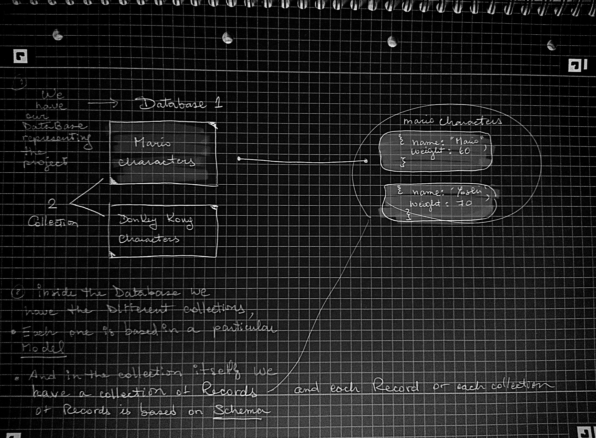

## RECAP

- what is MONGO

- INstallation (I already have)

- Connecting to Mongo

<br>
<br>
<br>
<hr>
<br>

#### WHAT IS MONGO DB?

<p> NoSQL database, instead of storing data in tables we store it in collection, the easy thing of this
  is that since we use javascript objects its easier to communicate with the noSQL data.
  </p>

#### Connecting to Mongo

- Create a TEST folder to test the connection
- Create a file inside the TEST folder: connection.js

<br>

- REQUIRE Mongoose:

```javascript
const mongoose = require("mongoose");
```

<br>

- CONNECT to mongodb

```javascript
mongoose.connect("mongodb://localhost/testaroo");
```

<p>The above practically says that we are connecting to "mongodb" database
  </p>

- //localhost

<p>Means that  we have connected MONGOdb locally 
  </p>

- //localhost/testaroo");

<p>testaroo correspond to the name of the database.
  </p>

- the .once in the line below means: just listen to this event ONCE

- the .open means: that once the connection is open, then you find/run this function

<br>

#### Although (what we just did in the lines above) this is going to run and connect our database, our application doesn't really know when that connection is completed.

###### For that you need the following:

```javascript
mongoose.connection.once("open", function () {
  console.log("Connection error", error);
});
```

- Just as .once which is an event listener that works "once",
  we can add another event listener but this one
  will take care of the ERRORS-

- Instead of just listening
  once for the "errors", we want to listen it for every error that
  we could encounter, so instead of .ONCE we use .ON

```javascript
on("error", function () {});
```

- So what it means here, is that whenever there is an ("error", it will run this callback function: function(){

     <br>

  ```javascript
  // HOW IT SHOULD LOOK LIKE
  //
  mongoose.connection
    .once("open", function () {
      console.log("Connection has been made... made some BUZZ");
    })
    .on("error", function (error) {
      console.log("Connection error", error);
    });
  ```

   <br>

###### NOW test it, type:

- node test/connection.js

<br>
<br>
<br>
<hr>
<br>

#### WHAT ARE COLLECTIONS?



<br>
<br>

#### CREATE THE "MODELS" folder and the mariochar.js file

- Inside the mariochar.js that lays inside the MODELS folder

- CREATE A SCHEMA for each of the records based on this model "mario character" for example (like in the image)

```javascript
const mongoose = require("mongoose");

const Schema = mongoose.Schema;
// require the mongoose property Schema to create a Schema

// CREATE SCHEMA AND MODEL
const MarioCharSchema = new Schema({
  // the new Schema makes reference to this: mongoose.Schema;

  name: String,
  wight: Number,
});

const MarioChar = mongoose.model("mariochar", MarioCharSchema);
```

- mariochar correspond to the MODEL,
  and this is our collection name.

  ```javascript
  model("mariochar",
  ```

- You are going to base this MODEL
  on a particular SCHEMA, this Schema
  right here: "MarioCharSchema".

  ```javascript
  mongoose.model("mariochar", MarioCharSchema);
  ```

<br>
<br>
<br>
<hr>
<br>

#### INSTALL mocha

<p>Mocha is a feature-rich JavaScript test framework running on Node.js and in the browser, making asynchronous testing simple and fun. Mocha tests run serially, allowing for flexible and accurate reporting, while mapping uncaught exceptions to the correct test cases.</p>

<br>

#### SAVING DATA TO MONGODB

```javascript
npm install mocha --save

```

##### IMPORT/REQUIRE MOCHA AND ASSERT

- You dont need to install assert as it s inside the mocha package

```javascript
const mocha = require("mocha");
const assert = require("assert");
//
// INSIDE THE package.json
  "scripts": {
    "test": "mocha"
  },
  "keywords": [
    "mongo",
    "mongoose",
    "tutorial",
    "recap"
  ],
  "author": "nadia",
  "license": "ISC",
  "dependencies": {
    "mocha": "^5.0.4",
    "mongoose": "^5.0.11",
    "nodemon": "^1.17.2"
  }
}

```

<br>

##### The Way MOCHA works:

- 'describe()' describes what we want to test rather than our test suite. For instance, 'describe("MyRobot")' describes the 'MyRobot' object I want to test.

- 'it()' specifies what the thing we want to test is supposed to do. For instance, 'it("mows my lawn")' will test if 'MyRobot' 'mows my lawn'.

```javascript
const mocha = require("mocha");
const assert = require("assert");
//
//
//
describe("some demo tests", function () {
  // CREATE TESTS
  it("adds two numbers together", function () {
    assert(2 + 3 === 5);
    //   you want to assert that  2+3 is equal to 5
    // so if 2+3 is true so 5, this assert passes , if the 2+3 was === to 4 it wont pass
  });
});
```

##### TEST IT

```javascript
npm run test
//
//
// RESULT
  some demo tests
    ✓ adds two numbers together
Connection has been made... made some BUZZ


  1 passing (14ms)


```

<br>
<br>
<br>
<hr>
<br>

#### SAVING DATA |

```javascript
// here below you create a "new" INSTANCE of the MarioChar model (inside the models folder)
var char = new MarioChar({
  name: "Mario",
});
```

##### save()

- With save() you are saving it to
  the database but since save() is asynchronous,
  we have to use something that is going to await
  until the process of saving is ready, and that
  is when the .then() comes in.

  ##### then()

- inside the then() you will
  add a call back function (),

##### .isNew

the char.isNew === false , means that if the character we
are saving is equal to false(dont exist) means that is not
longer new and that its now saved to the database, afterwards
you add the done();

##### done();

done() means "this test is now done"!

- DONT FORGET to add it here :

  it("Saves a record to the database", function (done) {

```javascript
describe("Saving records", function () {
  // CREATE TESTS
  it("Saves a record to the databse", function (done) {
    var char = new MarioChar({
      name: "Mario",
    });
    /*

    the char.isNew === false , means that if the character we
    are saving is equal to false(dont exist) means that is not
    longer new and that its now saved to the database, afterwards
    you add the done(); which means "this test is now done"!
    DONT FORGET to add it here :

     it("Saves a record to the database", function (done) {

    */
    char.save().then(function () {
```

#### PREVIEW

```javascript
// test.js

const mocha = require("mocha");
const assert = require("assert");
// importing the model schema in:   models/mariochar");
const MarioChar = require("../models/mariochar");

describe("Saving records", function () {
  // CREATE TESTS
  it("Saves a record to the databse", function (done) {
    // here below you create a "new" INSTANCE of the MarioChar model (inside the models folder)
    var char = new MarioChar({
      name: "Mario",
    });

    char.save().then(function () {
      assert(char.isNew === false);
      done();
    });
  });
  // next test
});
//
//
// RESULT
  Saving records
Connection has been made... made some BUZZ
    ✓ Saves a record to the databse (67ms)


  1 passing (88ms)


```

<br>

#### isNew property in Mongodb:

- "isNew" is going to find out if a record "is new"
  (has not been save yet) in the pre save callback
  of mongoose model schema.

<br>

- "isNew" is a boolean property on a model
  instance that indicates that
  (a record has not been save yet) . Access it as
  this.isNew from your pre save middleware.

[isNew_property](https://stackoverflow.com/questions/12092772/determine-if-a-record-is-new-in-the-pre-save-callback)

<br>
<br>
<br>
<hr>
<br>

### USING PROMISES 💍

Saving records
Connection has been made... made some BUZZ
✓ Saves a record to the database

1 passing (42ms)

##### SOMEHOW mongoose DOESNT WANT ME TO USE THE DEFAULT mongoose promise library, thats why you get a warning of "deprecation".

<p>So what i am going to do is use ES6 Promises</p>

```javascript
// This is ES6 default Promises and what i am doing here is overwriting it.
mongoose.Promise = global.Promise;
```

<br>

##### So if you run the test again, you will notice that even if it worked, the ORDER isn't right.

```javascript
Saving records
Connection has been made... made some BUZZ
  ✓ Saves a record to the databse


1 passing (42ms)
```

<br>

- WHAT i want is that this message "Connection has been made... made some BUZZ" comes before the
  "Saving records"

<br>

- What is happening is that theres nothing that tells MONGO that it should WAIT until it stablish the connection, before it goes ahead and run the test.

<br>

- RUNNING the test before it makes the connection is really stupid.

<br>

#### SO TO PREVENT THAT, we will have to use a HOOK in MOCHA

###### WHAT IS A HOOK?

- A HOOK is a function which tells MOCHA "look i want you to RUN this section of code either before
  you RUN the test or after you RUN the test, like so:

```javascript
//  CONNECT to the database before TEST run
before(function () {
    // add all the content of the connection
}
```

#### preview

```javascript
const mongoose = require("mongoose");

// ES6 Promises
mongoose.Promise = global.Promise;

//  CONNECT to the database before TEST run
before(function () {
  // Connect to mongodb

  mongoose.connect("mongodb://localhost/testaroo");
  mongoose.connection
    .once("open", function () {
      console.log("Connection has been made... made some BUZZ");
    })
    .on("error", function (error) {
      console.log("Connection error", error);
    });
  //
});
```

<br>

##### AT THIS POINT mongoose doesnt know when this is completed because this right here is an "asynchronous request" , so we need to tell mongoose when it s completed.

- SO PASS THE "done " parameter we saw before

```javascript
before(function (done) {
  // Connect to mongodb
  mongoose.connect("mongodb://localhost/testaroo");

  mongoose.connection
    .once("open", function () {
      console.log("Connection has been made... made some BUZZ");
      done();
    })
    .on("error", function (error) {
      console.log("Connection error", error);
    });
  //
});
```

##### test it : npm run test

```javascript
// RESULT BEFORE
Saving records
Connection has been made... made some BUZZ
  ✓ Saves a record to the databse


1 passing (42ms)
//
// RESULT AFTER CHANGES
Connection has been made... made some BUZZ
  Saving records
    ✓ Saves a record to the databse


  1 passing (43ms)
```

<br>

#### TO AVOID THIS KIND OF WARNING

```javascript
(node:7300) DeprecationWarning: current URL string parser is deprecated, and will be removed in a future version. To use the new parser, pass option { useNewUrlParser: true } to MongoClient.connect.
(node:7300) DeprecationWarning: current Server Discovery and Monitoring engine is deprecated, and will be removed in a future version. To use the new Server Discover and Monitoring engine, pass option { useUnifiedTopology: true } to the MongoClient constructor.
Connection has been made... made some BUZZ
  Saving records

```

#### ADD the following inside the connection

- useNewUrlParser: true,
- useUnifiedTopology: true,
- useCreateIndex: true,

##### like so:

```javascript
mongoose.connect("mongodb://localhost/testaroo", {
  useNewUrlParser: true,
  useUnifiedTopology: true,
  useCreateIndex: true,
});
```

#### RESULT

```javascript
> mocha


Connection has been made... made some BUZZ
  Saving records
    ✓ Saves a record to the databse


  1 passing (46ms)
```
