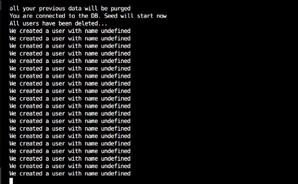
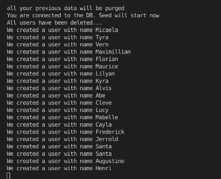
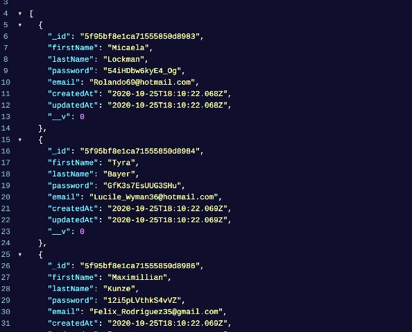
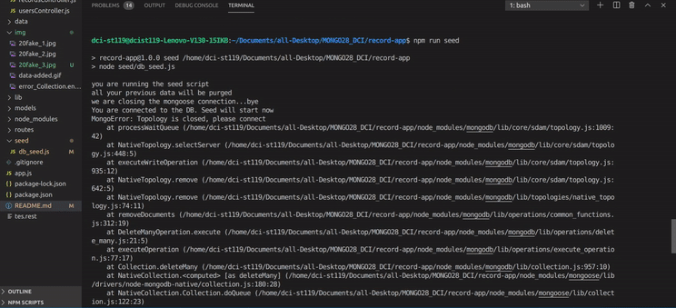
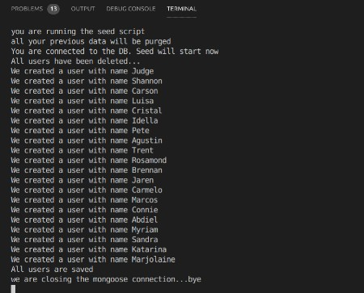

```javascript
//  usersControllers.js
exports.addUser = async (req, res, next) => {
  try {
    const user = new User(req.body);
    const data = await user.save();

    res.send(data);
  } catch (error) {
    next(error);
  }
};
/*The req.body is the data the user is passing, like so:
//POSTMAN, on POST method
{
"firstName": "Steve",
 "lastName": "Seasgull",
 "password": "12356",
 "email": "russian@gmail.com",

}
*/

//So this line
const user = new User(req.body);
//means:

//Its says YOU KNOW WHAT create a new User:
new User(
//  "based" on
//the User model User.js , and pass inside those guys
(req.body);
//so the data the user is giving:
/* {
"firstName": "Steve",

etc ...
*/


```

```javascript
// BEFORE
//  usersControllers.js
exports.addUser = async (req, res) => {
  const user = new User(req.body); //here you create the user
  await user.save(); //here you save the user to the DATA BASE
};
```

```javascript
// AFTER
//  usersControllers.js
exports.addUser = async (req, res, next) => {
  try {
    // here we create a new user: new User(req.body);
    // and for each one of them we save it:  await user.save();

    const user = new User(req.body);
    const data = await user.save(); //save() will save it to the database

    res.send(data); //sending back the data saved in the data base
    //  every time you use async await you do : try catch because otherwise you are fucked
  } catch (error) {
    next(error); //the generic  error message is in app.js
  }
};
/*
                    ** TRY / CATCH EXPLANATION **

  what are you going to try :

    const user = new User(req.body);
    const data = await user.save(); //save() will save it to the database

    res.send(data);

    AND IF FOR SOME REASON theres something wrong **
    
    THEN catch it with an error, the error is in app,js:

  let error = new Error(`The route ${req.url} does not exist`);
  error.code = 404;
  next(error);

  // * forward the error to our generic error handler below  *
  ------------------------------------------------------------

SO THAT IS WHAT THIS MEANS:

  try {
// here we create a new user: new User(req.body); and for each one of them we save it:  await user.save();

    const user = new User(req.body);
    const data = await user.save(); //save() will save it to the database

    res.send(data); //sending back the data saved in the data base
    //  every time you use async await you do : try catch because otherwise you are fucked
  } catch (error) {
    next(error);
  }
};

  
});
  
  
  */
```

<br>
<hr>
<br>
<br>
<br>

### Concerning this error:

```javascript
(node:10622) DeprecationWarning: collection.ensureIndex is deprecated. Use createIndexes instead.
```

#### The Reason

<p>The issue is that mongoose still uses collection.ensureIndex 
and should be updated by them in the near future. To get rid of the 
message you can downgrade by using version 5.2.8 in your package.json (and delete any caches, 
last resort is to uninstall it the install it with npm install mongoose@5.2.8):</p>

```javascript
//THE SOLUTION
mongoose.set("useNewUrlParser", true);
mongoose.set("useFindAndModify", false);
mongoose.set("useCreateIndex", true);

//          ** Add it here:

// CONNECT TO DB
const mongoose = require("mongoose");
mongoose.connect("mongodb://localhost/fbw28-record-store", {
  useNewUrlParser: true,
  useUnifiedTopology: true,
  useCreateIndex: true,
});
```

<br>
<br>

<hr>
<hr>
<br>
<br>

## 🌱 🌱 SEED SCRIPT 🌱 🌱

<br>

###### The Job of the SEED script will be to empty the data base of the data we have and then it will create 20 users for new users for example, or 20 new records etc etc.

<p>IT WILL BE AN SCRIPT inside the project but will work independently and we will be able to run in like with "npm run seed or something"</p>

<p>The SEED script will connect to the data base and will use the USER module we have to create 20 users then it will store it and then bye</p>

##### start

- make a new faolder and call it seed

- create a file inside the seed folder, call it: db_seed.js

- inside the file add the following to test the server on SEED

```javascript
// db_seed.js
console.log("you are running the seed script");
console.log("all your previous data will be purged");
```

- but before testing it add the script to run it, like so:

```javascript
// package.json
 "seed": "node seed/db_seed.js"

```

- Now run npm run seed

<br>
<br>

##### ADD FAKER

<p>faker.js - generate massive amounts of fake data in the browser and node.js</p>

```javascript
npm i faker
```

<p>From faker we will need fake names, lastNames, passwords etc for the fake users.</p>

#### Once you installed faker follow the steps below:

- We connect to the database
- we purge all the users
- we create 20 fake users
- we close the db connection

<br>

##### 1\_ We CONNECT to the database

<p>Go to the app.js and copy all what you need to set up the connection to the server, then hide all related to start the server, as you are not going to start a NEW one but just CONNECT to the existent one</p>

<br>

```javascript
// We connect to the database

//HIDE** const express = require("express");
//  we dont need express because we are not going to start the server
//
//HIDE** const cors = require("cors"); the same for cors, we are not going to the server
//HIDE** const app = express();
//HIDE**  const port = 5000;

//                               CONNECT TO DataBase
//
const mongoose = require("mongoose");
//
//
mongoose.connect("mongodb://localhost/fbw28-record-store", {
  useNewUrlParser: true,
  useUnifiedTopology: true,
  useCreateIndex: true,
});

const db = mongoose.connection;
db.on("error", console.error.bind(console, "connection error:"));

db.once("open", () => {
  console.log(`You are connected to the DB. Seed will start now`);
});

//
// --------------------------
```

<br>

##### 2\_ WE PURGE all the users

<p>The problem with the code below is that you have to be inside an asynchronous function, otherwise it can be that it will not work</p>

<br>

```javascript
// NO ASYNC FUNCTION
// --------------------------
//
//  we purge all the users

try {
  // if you want to await stuff you have to be inside an async function
  //   to do it , you have to use an IIFE (Self-invoking functions in js)
  await User.deleteMany({});
  console.log(`All users have been deleted...`);
} catch (err) {
  console.log(err);
}

//
// --------------------------
```

```javascript
// WITH ASYNC FUNCTION
const mongoose = require("mongoose");
const User = require("../models/User");

console.log("you are running the seed script");
console.log("all your previous data will be purged");

//
// --------------------------

//                               CONNECT TO DataBase
// IIFE function to do work with the async await

(async function () {
  //now that we are using an async function, the wait here will not complain:
  //     await User.deleteMany({});
  //
  mongoose.connect("mongodb://localhost/fbw28-record-store", {
    useNewUrlParser: true,
    useUnifiedTopology: true,
    useCreateIndex: true,
  });

  const db = mongoose.connection;
  db.on("error", console.error.bind(console, "connection error:"));

  db.once("open", () => {
    console.log(`You are connected to the DB. Seed will start now`);
  });

  //
  // --------------------------
  //
  //  we purge all the users

  try {
    // if you want to await stuff you have to be inside an async function
    //   to do it , you have to use an IIFE (Self-invoking functions in js)
    await User.deleteMany({});
    console.log(`All users have been deleted...`);
  } catch (err) {
    console.log(err);
  }

  //
  // we create 20 fake users
  // we close the db connection
})();

//
// --------------------------
```

#### AFTER setting up the async await function, go to the POSTman and test it

<p>Under GET, type the following: </p>

```javascript
http://localhost:5000/users
// TO SEE ALL THE CONTENT OF THE DATABSE
```

<p>Once you checked all the databases , go to the terminal in vs and type :<p>

```javascript
npm run seed
// if it worked, all should be gone!
```

<p>if it worked, all should be gone! TO SEE if it worked go back to the postman and check it again<p>

<br>
<br>

#### WHY ARE WE WRAPPING THE WHOLE THING?

<p>Joseph told that even if the await works without having the async , its because At the moment we only have one but since we are going to have more, it s really necessary to add the async otherwise we will face ERRORS<p>

<br>
<br>

#### CREATE 20 FAKE USERS with FAKER

```javascript
//We create 20 fake users

  const userPromises = Array(20)
    .fill(null)
    .map(() => {
      const user = new User({
        firstName: faker.name.firstName(),
        lastName: faker.name.lastName(),
        password: faker.internet.password(),
        email: faker.internet.email(),
      });

      console.log(`We created a user with name ${user.name}`);

      return user.save();
    });
})();
```

#### Explanation

- we create a User using the class User,
  this User correspond to the User we have inside the model

  <br>

- I make an ARRAY of 20:

```javascript
const userPromises = Array(20);
```

- I FILL it with nothing:

```javascript
.fill(null)
```

- And then I MAP it:

```javascript
 .map(() => {
```

- Through each element:

```javascript

firstName: faker.name.firstName(),
lastName: faker.name.lastName(),
password: faker.internet.password(),
email: faker.internet.email(),
```

<br>

###### So as we map through the array, We create a USER for each element:

```javascript
.map(() => {
We create a USER for each element:
firstName: faker.name.firstName(),
lastName: faker.name.lastName(),
password: faker.internet.password(),
email: faker.internet.email(),
```

###### AND THEN we want to save this user and keep the promise of "saved INSIDE" the array

```javascript
return user.save();
/* 
this is a promise and is returning a new User every time 
for 20 times
*/
```

##### so after the whole array with the User content, we have an array with 20 promises, dont forget to type "npm run seed" to see the result



##### BUT that is not what we want (Vasilis did a mistake)

- instead of typing name you should put firstName

```javascript
//BEFORE:  ${user.name}`);
console.log(`We created a user with name ${user.firstName}`);
```

- now you can see the fake names



- To see the whole result, go to the browser and type:http://localhost:5000/users



  <br>
    <br>

### THE 20 PROMISES

##### In order to save it for all the 20 users, like when you save it for an individual User, we need to resolve all the promises at the same time, for that we need another TRY AND CATCH

```javascript
//
  const userPromises = Array(20)
    .fill(null)
    .map(() => {
      const user = new User({
        firstName: faker.name.firstName(),
        lastName: faker.name.lastName(),
        password: faker.internet.password(),
        email: faker.internet.email(),
      });

      console.log(`We created a user with name ${user.firstName}`);

      return user.save();
    });
//
//
  try {
    await Promise.all(userPromises);
    console.log(`All users are saved`);
  } catch (error) {
    console.log(error);
  }
//
//


})();

```

<br>
<br>

#### CLOSING THE CONNECTION after we are DONE!

<p>In this example you will see that if you add the closing of the connection outside the ASYNC FUNCTION, it s going to show and ERROR,
And the reason for that is due to the fact that since we are putting the closing of the connection in the global area, its taking as a priority, so thats why you have this error.</p>



### THE SOLUTION

- Just add the closing inside the ASYNC FUNCTION, like so:

```javascript
  const userPromises = Array(20)
    .fill(null)
    .map(() => {
      const user = new User({
        firstName: faker.name.firstName(),
        lastName: faker.name.lastName(),
        password: faker.internet.password(),
        email: faker.internet.email(),
      });

      console.log(`We created a user with name ${user.firstName}`);

      return user.save();
    });

  try {
    await Promise.all(userPromises);
    console.log(`All users are saved`);
  } catch (error) {
    console.log(error);
  }


  console.log("we are closing the mongoose connection...bye");

  // Since we named mongoose.connect("mongodb: in the beginning you can end up with the same
  mongoose.connection.close();
})();

```



<p>Now it will work because all of the stuff inside the ASYNC function, is going to be checked one by one until we reach  the end of it</p>
