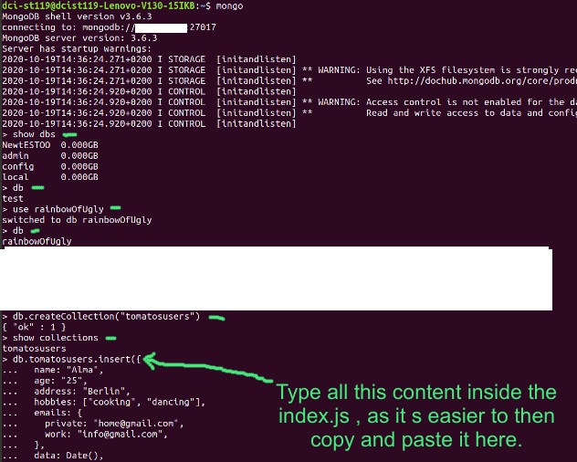
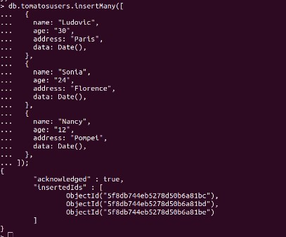
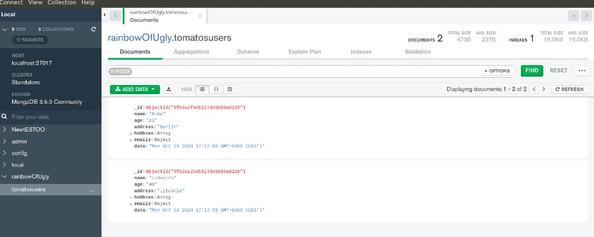

## MONGO INITIALIZATION

### After you installed MONGO | Launch the server and then open the Shell

<br>

```javascript

// TYPE this to launch the server
sudo systemctl status mongodb


// Once you see a green dot, it means it s running
// IF IT S RUNNING , open another tab and type:

mongo
// it will launch the shell


// it will show you this:

>

//it means you can start creating the collections etc


```

 <br>

#### Create a Database

```javascript
// First check if you have other data bases
show dbs
// to create a data base type use + the name you want for the database
use rainbowOfUgly
// now check if you are inside the database you just created
db
// To remove
db.dropDatabase(); //you can avoid the semi colon
```

 <br>



<br>

#### Create a Collection

```javascript
// create a data collection
db.createCollection("tomatosusers");
//result: { "ok" : 1 }

// type show collections
show collections
// result: tomatosusers

```

<br>

##### Now go to the VS | CREATE an "index.js" and type the following :

```javascript
//
// individual
//
db.tomatosusers.insert({
  name: "Alma",
  age: "25",
  address: "Berlin",
  hobbies: ["cooking", "dancing"],
  emails: {
    private: "home@gmail.com",
    work: "info@gmail.com",
  },
  data: Date(),
});
// new
db.tomatosusers.insert({
  name: "Ludovico",
  age: "40",
  address: "Lituania",
  hobbies: ["writing", "playing violon"],
  emails: {
    private: "home@gmail.com",
    work: "info@gmail.com",
  },
  data: Date(),
});
```

<br>

##### SEVERAL

```javascript
db.tomatosusers.insertMany([
  {
    name: "Ludovic",
    age: "30",
    address: "Paris",
    data: Date(),
  },
  {
    name: "Sonia",
    age: "24",
    address: "Florence",
    data: Date(),
  },
  {
    name: "Nancy",
    age: "12",
    address: "Pompei",
    data: Date(),
  },
]);
```



<br>

<p> Now copy and paste it in the terminal, by doing that you are inserting it to the tomatos user db, this is the "vs" way of doing it otherwise you have the super easy way in MONGO, where you fill the fields.</p>

<br>

#### OPEN DE COMPASS to see if the data was inserted, this is how it should look:


