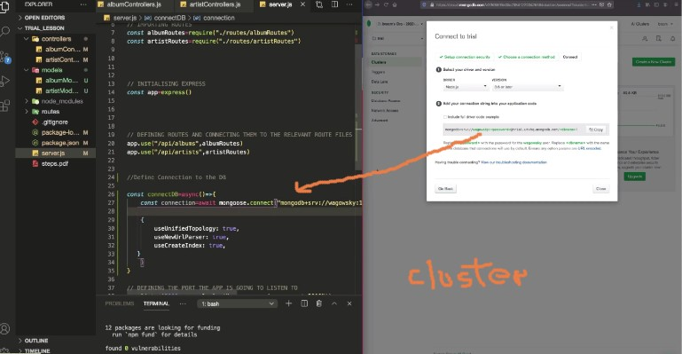

# EXAMPLE Lesson BY Wagowsky

#### THIS EXERCISE will only shows how models/schemas controllers and routes work all together.

###### In the lesson we could see how the collection (which i dont have) look like inside MONGO from wagowsky, but still not clear of how you get into that result when stting up the password for the link to make the connection (when using the cluster). Wasily told us we will learn that in few weeks.

<br>
<br>

- the cluster for the password:



<br>
<br>
<br>
<br>

##### 1 SET UP THE SERVER.JS

```javascript
const express = require("express");

//
//

// importing Routes
const albumRoutes = require("./routes/albumRoutes");
//
const artistRoutes = require("./routes/artistRoutes");

// initializing EXPRESS
const app = express();

/* 

DEFINING ROUTES AND CONNECTING THEM to the 
Relevant Route FILES

app.use("/api/albums", albumRoutes);
app.use("/api/artists", artistRoutes);

the 2 lines above are connected to the controllers
to this:

   const albums = await Album.find({}); //Album.find({}); it will return all the data inside the "album"
    res.status(200);
    res.send(albums);

*/

app.use("/api/albums", albumRoutes);
app.use("/api/artists", artistRoutes);

/* 

Defining the Port the APP is going 
to Listen to

*/
app.listen(5000, console.log("server running on PORT 5000"));
```

<br>
<br>

##### 2 SET UP THE MODELS FOLDER and create the 2 files (albumModel.js and artistModel.js)

```javascript
//
const AlbumSchema = mongoose.Schema({
  title: {
    type: String,
    required: true,
  },
  yearReleased: {
    type: String,
    required: true,
  },
});
// TO SHORTER THE LINE between line 19 and 20 , you can also do this:
module.exports = Album = mongoose.model("albums", AlbumSchema);
// albums is the name of the collection in the folder in the database, compass for example helps you to see what you have.

/*


ANSWERING Natia's question about WHY we cannot
add 2 collections in the same file.

HE EXPLAINED that it would clash at a certain point because 
in this line where you export the MODULE:

                      const Artist = mongoose.model("artists", ArtistSchema);
you only have the 
possibility to add ONE COLLECTION, so thats why!!

Its actually because you wouldn't be able to differentiate between the 2 MODULES.


*** NOW COPY THIS SCHEMA AND PASTE it inside the artistModel.js
change some data


*/
const ArtistSchema = mongoose.Schema({
  name: {
    type: String,
    required: true,
  },
  yearFounded: {
    type: String,
    required: true,
  },
});
```

<br>
<br>

##### 3 SET UP THE Controllers FOLDER and create the 2 files (albumControllers.js and artistController.js)

<br>

##### 4 IMPORT THE respective MODEL to each controller

```javascript
// IMPORTING the RESPECTIVE MODEL
//
// 1
const Artist = require("../models/artistModel");
// IMPORTING the RESPECTIVE MODEL
//
// 2
const Album = require("../models/albumModel");
```

<br>
<br>

##### FETCHING THE MODELS albums and artists using(ASYNC-AWAIT and try and catch for the errors)

```javascript
exports.getAlbums = async (req, res) => {
  /*
                    const albums = await Album.find({});  line: 25

    //it will return all the data inside the "album" which is
     the schema stuff, and then transform it into the variable "albums", that
      will accepted only if everything was fine with the request.


     */

  const albums = await Album.find({}); //Album.find({}); it will return all the data inside the "album" so the schema stuff
  res.status(200);
  res.send(albums);
};
```

<br>

##### DOING it correctly with TRY & CATCH (error handling)

```javascript
exports.getAlbums = async (req, res) => {
  try {
    const albums = await Album.find({}); //Album.find({}); it will return all the data inside the "album"
    res.status(200);
    res.send(albums);
  } catch (error) {
    res.status(400); //show an error if the info was negative
    res.send(error.message);
  }
};
```

<br>

#### AFTER we created the MODELS, the next thing to do would be to create the ROUTES Folder and create a controller for each model respectively:

<br>

```javascript
//albumModel.js
albumRoutes.js;

//artistModel.js
artistRoutes.js;
```

<br>

<p>But what are Routes?</p>

<p>"Routes"  will forward the requests  to the appropriate controller functions. what is Routes forwarding to the controllers? requests and any information encoded in request URLs</p>

<p>and what are Controllers?</p>

<p>Controllers will get the requested data "from" the models/ Schema depending on that, it will create a an HTML page displaying the data, and return it to the user to view in the browser.
,  </p>

<br>
<br>

- HOW IT WORKS:


<br>
<br>

#### its related to the following in the server:

- app.use: for when you want to use the imported controllers
  and therefore what these controllers contain which is the models/schema:

```javascript
// server.js
// importing Routes
const albumRoutes = require("./routes/albumRoutes");
//
const artistRoutes = require("./routes/artistRoutes");

//
//
// https://developer.mozilla.org/en-US/docs/Learn/Server-side/Express_Nodejs/routes
```

```javascript
// server.js
app.use("/api/albums", albumRoutes);
app.use("/api/artists", artistRoutes);
```
